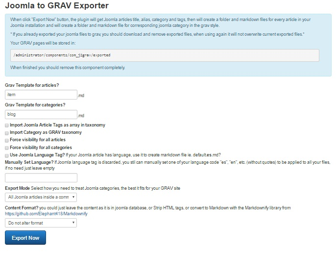
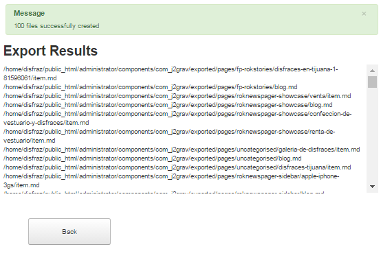

# Joomla to Grav Exporter

This is a joomla basic component that will export Joomla articles and categories to GRAV folders and files

## Installation

To install just download this repo and zip files where j2grav.xml file is on the root of the zip file. Now use Joomla install from file procedure and select your zip file.

## How it works?

After installation go to Joomla Administrator Components > J2Grav.

Read and fill the parameters shown in form and when click "Export Now" button, the plugin will get Joomla articles title, alias, category and tags, then will create a folder and markdown files for every article in your Joomla installation and will create a folder and markdown file for corresponding joomla category in the Grav style.

*Will not create nested categories

Browse your server and download your Grav pages, will be stored in: `/administrator/components/com_j2grav/exported`

When finished you should remove this component completely.
